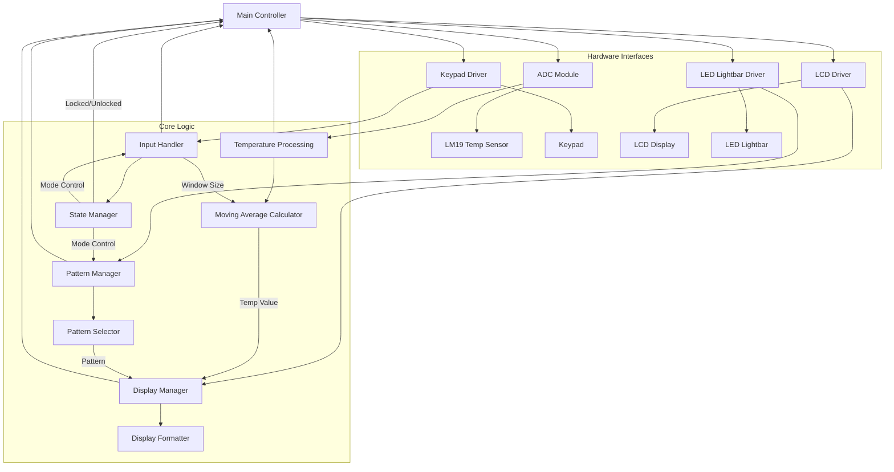

## Software Architecture

```mermaid
graph TD
    A[Main Controller] --> B[ADC Module]
    A --> C[Keypad Driver]
    A --> D[LCD Driver]
    A --> E[LED Lightbar Driver]
    
    B --> F[Temperature Processing]
    F --> A
    
    C --> G[Input Handler]
    G --> A
    
    D --> H[Display Manager]
    H --> A
    
    E --> I[Pattern Manager]
    I --> A
    
    subgraph Hardware Interfaces
        B --> J[LM19 Temp Sensor]
        C --> K[Keypad]
        D --> L[LCD Display]
        E --> M[LED Lightbar]
    end
    
    subgraph Core Logic
        F --> N[Moving Average Calculator]
        G --> O[State Manager]
        H --> P[Display Formatter]
        I --> Q[Pattern Selector]
    end
    
    O -->|Locked/Unlocked| A
    O -->|Mode Control| G
    O -->|Mode Control| I
    N -->|Temp Value| H
    Q -->|Pattern| H
    G -->|Window Size| N
```

